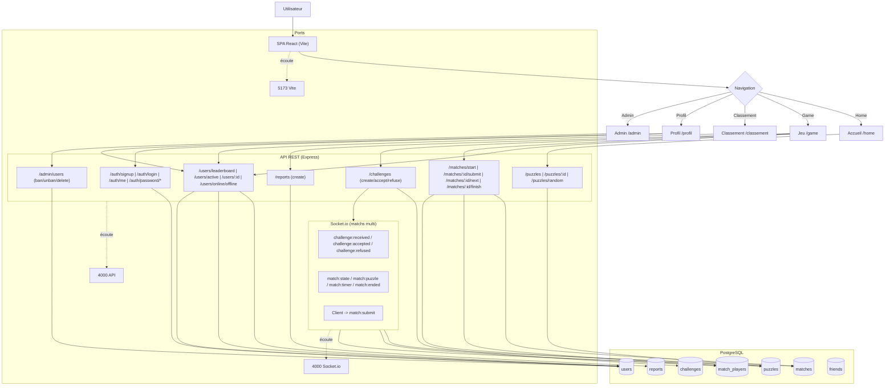

# Diagramme de flux — ChessBattle (Front + API + Socket)

- Le front consomme l’API REST pour l’auth, le profil, le classement et les matchs solo.
- Les matchs multi sont orchestrés via **Socket.io** après acceptation d’un défi.
