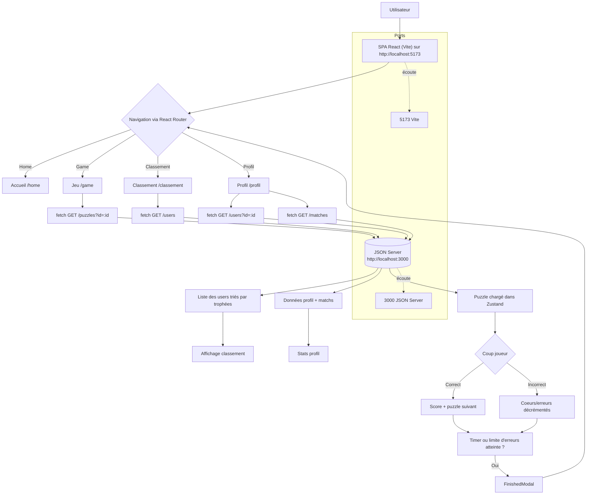

# Diagramme de flux — ChessBattle (front + JSON Server)

- Le flux illustre le front actuel branché sur le mock `db.json` via JSON Server (aucun backend temps réel pour l'instant).
- Les endpoints utilisés : `/users`, `/users?id=:id`, `/matches`, `/puzzles?id=:id`.
