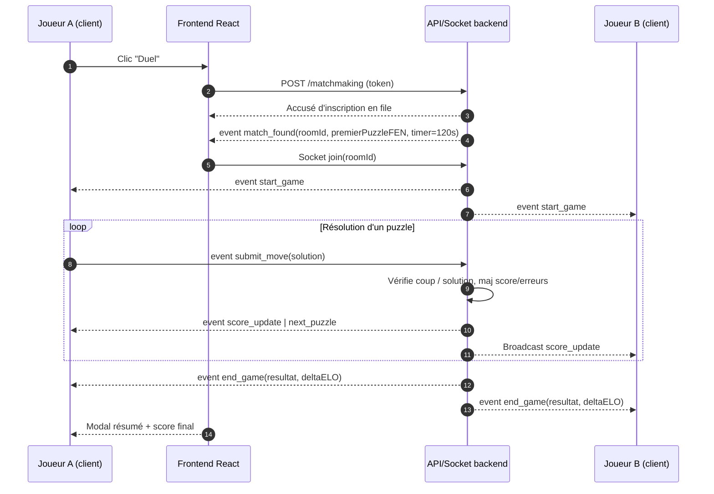
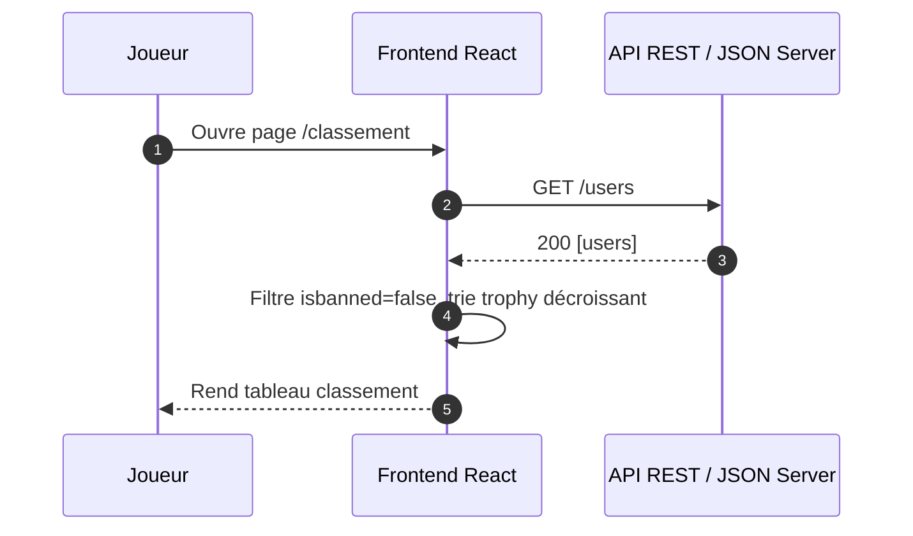

# Diagrammes de séquence ChessBattle

## Duel temps réel

```mermaid
sequenceDiagram
    autonumber
    participant A as Joueur A (client)
    participant F as Frontend React
    participant S as API/Socket backend
    participant B as Joueur B (client)

    A->>F: Clic "Duel"
    F->>S: POST /matchmaking (token)
    S-->>F: Accusé d'inscription en file
    S-->>F: event match_found(roomId, premierPuzzleFEN, timer=120s)
    F->>S: Socket join(roomId)
    S-->>A: event start_game
    S-->>B: event start_game
    loop Résolution d'un puzzle
        A->>S: event submit_move(solution)
        S->>S: Vérifie coup / solution, maj score/erreurs
        S-->>A: event score_update | next_puzzle
        S-->>B: Broadcast score_update
    end
    S-->>A: event end_game(resultat, deltaELO)
    S-->>B: event end_game(resultat, deltaELO)
    F-->>A: Modal résumé + score final
```

## Consultation du classement

```mermaid
sequenceDiagram
    autonumber
    participant U as Joueur
    participant F as Frontend React
    participant API as API REST / JSON Server

    U->>F: Ouvre page /classement
    F->>API: GET /users
    API-->>F: 200 [users]
    F->>F: Filtre isbanned=false, trie trophy décroissant
    F-->>U: Rend tableau classement
```
