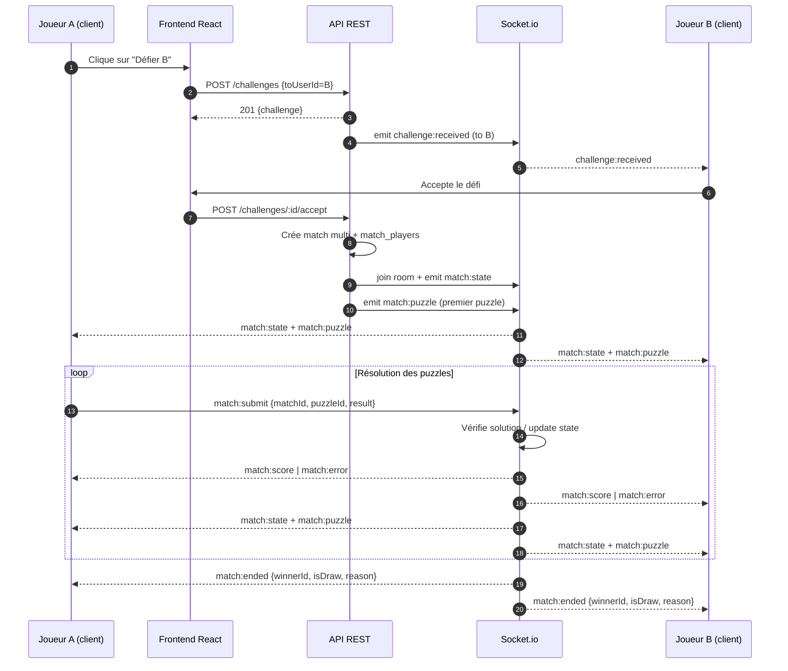
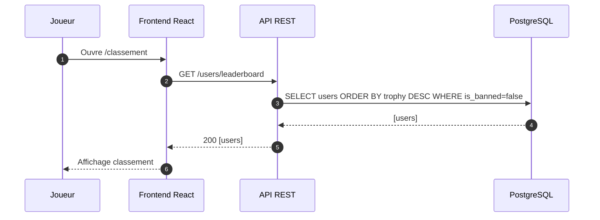

# Diagrammes de séquence ChessBattle

## Duel temps réel (défi + match multi)

```mermaid
sequenceDiagram
    autonumber
    participant A as Joueur A (client)
    participant F as Frontend React
    participant API as API REST
    participant WS as Socket.io
    participant B as Joueur B (client)

    A->>F: Clique sur "Défier B"
    F->>API: POST /challenges {toUserId=B}
    API-->>F: 201 {challenge}
    API->>WS: emit challenge:received (to B)
    WS-->>B: challenge:received

    B->>F: Accepte le défi
    F->>API: POST /challenges/:id/accept
    API->>API: Crée match multi + match_players
    API->>WS: join room + emit match:state
    API->>WS: emit match:puzzle (premier puzzle)
    WS-->>A: match:state + match:puzzle
    WS-->>B: match:state + match:puzzle

    loop Résolution des puzzles
        A->>WS: match:submit {matchId, puzzleId, result}
        WS->>WS: Vérifie solution / update state
        WS-->>A: match:score | match:error
        WS-->>B: match:score | match:error
        WS-->>A: match:state + match:puzzle
        WS-->>B: match:state + match:puzzle
    end

    WS-->>A: match:ended {winnerId, isDraw, reason}
    WS-->>B: match:ended {winnerId, isDraw, reason}
```

## Consultation du classement

```mermaid
sequenceDiagram
    autonumber
    participant U as Joueur
    participant F as Frontend React
    participant API as API REST
    participant DB as PostgreSQL

    U->>F: Ouvre /classement
    F->>API: GET /users/leaderboard
    API->>DB: SELECT users ORDER BY trophy DESC WHERE is_banned=false
    DB-->>API: [users]
    API-->>F: 200 [users]
    F-->>U: Affichage classement
```
