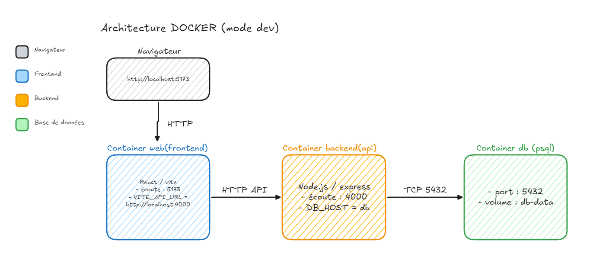
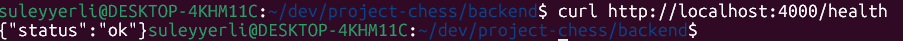

# Mise en place de l’architecture Docker (mode développement)

## Introduction

J’ai réfléchi à l’optimisation de mon développement ainsi qu’à la mise en production par la suite. J’ai donc choisi de **mettre en place un environnement de développement avec Docker**.

Pour le développement, j’ai décidé de créer **un conteneur Docker par service** :

- un conteneur pour le **backend**,
- un conteneur pour le **frontend**,
- un conteneur **PostgreSQL** pour la base de données.

Ces conteneurs sont ensuite interconnectés entre eux. Cette approche me permet d’optimiser mon développement en démarrant l’ensemble des services avec **une seule commande**, puis de tester immédiatement l’application.

---

## Architecture (mode dev)



---

## Conteneur Backend

> cf. ticket **#19** sur le repository GitHub

### Création du Dockerfile

```dockerfile
FROM node:22-alpine

WORKDIR /app

COPY package*.json ./
RUN npm ci --omit=dev

COPY . .

ENV NODE_ENV=production
EXPOSE 4000

CMD ["npm", "start"]
```

### Création du fichier `.dockerignore`

```bash
node_modules
npm-debug.log*
yarn-debug.log*
pnpm-debug.log*
dist
coverage
logs
*.log
.env
.env.*
.git
Dockerfile
.dockerignore
```

### Lancement et tests

#### 1. Build de l’image

```bash
docker build -t chessbattle-backend .
```

#### 2. Lancement du conteneur

**Avec un fichier `.env`**

```bash
docker run --rm -d -p 4000:4000 --env-file .env --name chessbattle-backend chessbattle-backend
```

**Sans fichier `.env`**

```bash
docker run --rm -d -p 4000:4000 -e PORT=4000 --name chessbattle-backend chessbattle-backend
```

#### 3. Test de la route de santé

```bash
curl http://localhost:4000/health
```

Résultat attendu :

```json
{ "status": "ok" }
```



---

## Docker Compose : Backend + PostgreSQL (ticket #20)

### Création du fichier `docker-compose.yml`

```yaml
version: "3.9"

services:
  db:
    image: postgres:17-alpine
    container_name: dev-chessbattle-db
    env_file:
      - ./backend/.env
    ports:
      - "5432:5432"
    volumes:
      - db_data:/var/lib/postgresql/data

  backend:
    build: ./backend
    container_name: dev-chessbattle-backend
    env_file: ./backend/.env
    ports:
      - "4000:4000"
    depends_on:
      - db

volumes:
  db_data:
```

### Explication de la stack Docker (dev)

Ce fichier `docker-compose.yml` lance deux services : **PostgreSQL** et le **backend Express**.

#### Services

**db (PostgreSQL 17 – image Alpine)**

- Variables d’environnement chargées depuis `./backend/.env` :
  - `POSTGRES_USER`
  - `POSTGRES_PASSWORD`
  - `POSTGRES_DB`
- Port `5432` exposé pour permettre la connexion depuis l’hôte local
- Volume `db_data` pour persister les données entre deux `docker compose up`

**backend**

- Build à partir du `Dockerfile` situé dans `./backend`
- Variables d’environnement chargées depuis `./backend/.env` (`PORT`, `DATABASE_URL`, etc.)
- Port `4000` exposé en local
- `depends_on: db` : le backend démarre après PostgreSQL

#### Volumes

- `db_data` : volume nommé permettant la persistance des données PostgreSQL

### Commandes usuelles

- Lancer la stack :

```bash
docker compose up -d
```

- Voir les logs du backend :

```bash
docker compose logs backend -f
```

- Tester la route de santé :

```bash
curl http://localhost:4000/health
```

- Arrêter la stack :

```bash
docker compose down
```

---

## Conteneurisation du Frontend

_À suivre…_
