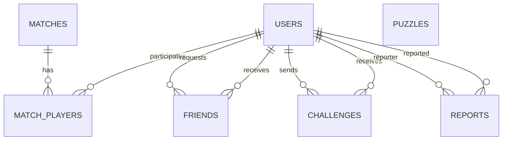
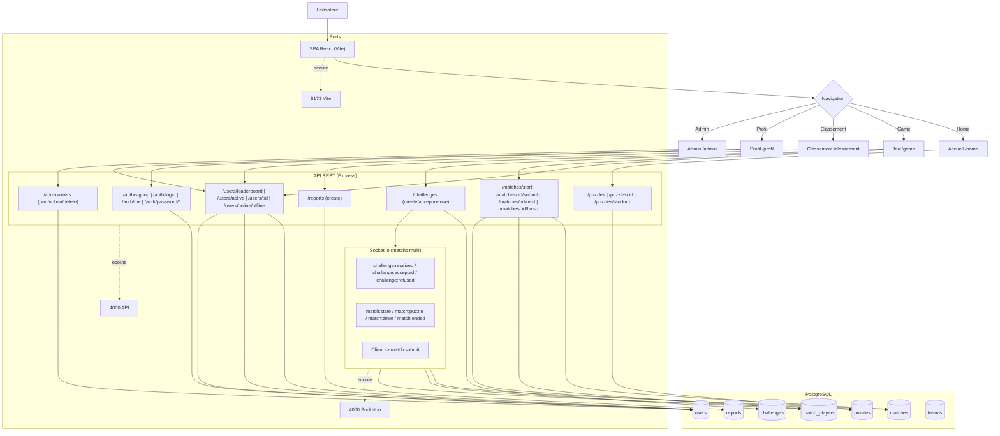
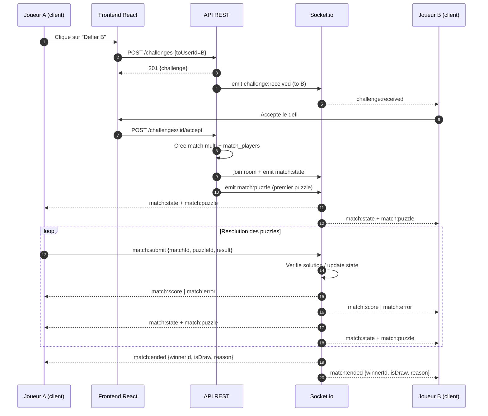
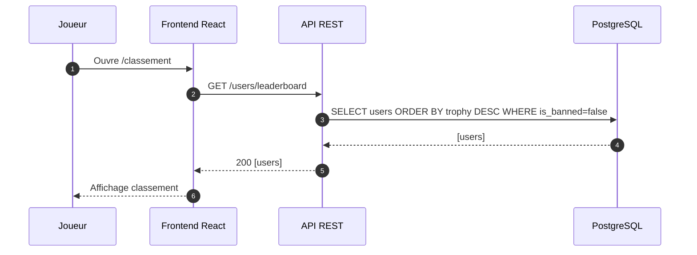

# Dossier d'analyse - ChessBattle

## 1. Contexte et perimetre

ChessBattle est une application web de puzzles d'echecs. Le projet inclut :

- un mode solo (progression Elo sur 20 puzzles)
- un mode multi en temps reel (defis + Socket.io)
- un profil utilisateur avec statistiques
- un classement par trophees
- un systeme de signalement et de moderation
- un back-end REST + WebSocket et une base PostgreSQL

## 2. Dictionnaire des donnees

## Table : USERS

| Champ                  | Type        | Null | Defaut | Description                                          |
| ---------------------- | ----------- | ---- | ------ | ---------------------------------------------------- |
| id                     | INT, PK     | Non  | Auto   | Identifiant unique de l'utilisateur                  |
| email                  | TEXT        | Non  | -      | Email unique du joueur                               |
| password               | TEXT        | Non  | -      | Mot de passe hashe                                   |
| pseudo                 | TEXT        | Non  | -      | Pseudo unique du joueur                              |
| avatar                 | BYTEA       | Oui  | null   | Avatar (stockage disque cote app, colonne conservee) |
| banner                 | TEXT        | Oui  | null   | Nom ou chemin de la banniere                         |
| emblem                 | TEXT        | Oui  | null   | Nom ou chemin de l'embleme                           |
| trophy                 | INT         | Non  | 0      | Trophees du joueur                                   |
| nbgame                 | INT         | Non  | 0      | Parties jouees                                       |
| nbwin                  | INT         | Non  | 0      | Victoires                                            |
| nblose                 | INT         | Non  | 0      | Defaites                                             |
| nbdraw                 | INT         | Non  | 0      | Parties nulles                                       |
| bio                    | TEXT        | Oui  | null   | Biographie du joueur                                 |
| joined_at              | TIMESTAMPTZ | Non  | NOW()  | Date d'inscription                                   |
| role                   | TEXT        | Non  | user   | Role (valeurs utilisees : user, admin)               |
| is_active              | BOOLEAN     | Non  | true   | Compte actif                                         |
| nbreport               | INT         | Non  | 0      | Signalements recus                                   |
| is_banned              | BOOLEAN     | Non  | false  | Utilisateur banni                                    |
| ban_reason             | TEXT        | Oui  | null   | Raison du bannissement                               |
| last_seen              | TIMESTAMPTZ | Oui  | null   | Derniere activite connue                             |
| reset_password_token   | TEXT        | Oui  | null   | Jeton de reinitialisation                            |
| reset_password_expires | TIMESTAMPTZ | Oui  | null   | Expiration du jeton                                  |
| ban_label              | TEXT        | Oui  | null   | Libelle de bannissement (Triche, Anti-jeu)           |
| banned_until           | TIMESTAMPTZ | Oui  | null   | Date de fin du bannissement                          |

---

## Table : PUZZLES

| Champ    | Type    | Null | Defaut | Description                     |
| -------- | ------- | ---- | ------ | ------------------------------- |
| id       | INT, PK | Non  | Auto   | Identifiant du puzzle           |
| fen      | TEXT    | Non  | -      | Position FEN                    |
| solution | JSONB   | Non  | -      | Liste des coups solution        |
| elo      | INT     | Non  | -      | Difficulte                      |
| themes   | TEXT[]  | Non  | -      | Tags (mateIn1, fork, sacrifice) |

---

## Table : MATCHES

| Champ       | Type        | Null | Defaut | Description                                 |
| ----------- | ----------- | ---- | ------ | ------------------------------------------- |
| id          | INT, PK     | Non  | Auto   | Identifiant                                 |
| mode        | TEXT        | Non  | -      | Mode de jeu (solo, multi)                   |
| finished_at | TIMESTAMPTZ | Oui  | null   | Fin du match                                |
| state       | JSONB       | Oui  | null   | Etat de la partie (progression, erreurs...) |

---

## Table : MATCH_PLAYERS

| Champ          | Type    | Null | Defaut | Description            |
| -------------- | ------- | ---- | ------ | ---------------------- |
| id             | INT, PK | Non  | Auto   | Participation          |
| match_id       | INT, FK | Non  | -      | Identifiant du match   |
| user_id        | INT, FK | Non  | -      | Identifiant du joueur  |
| is_winner      | BOOLEAN | Non  | false  | Gagnant                |
| puzzles_solved | INT     | Non  | 0      | Puzzles resolus        |
| trophies_delta | INT     | Non  | 0      | Gain/perte de trophees |

---

## Table : FRIENDS

| Champ        | Type        | Null | Defaut  | Description                         |
| ------------ | ----------- | ---- | ------- | ----------------------------------- |
| id           | INT, PK     | Non  | Auto    | Identifiant                         |
| requester_id | INT, FK     | Non  | -       | ID de l'envoyeur                    |
| receiver_id  | INT, FK     | Non  | -       | ID du receveur                      |
| status       | TEXT        | Non  | pending | Statut (pending, accepted, blocked) |
| created_at   | TIMESTAMPTZ | Non  | NOW()   | Date de creation                    |

---

## Table : CHALLENGES

| Champ        | Type        | Null | Defaut  | Description                         |
| ------------ | ----------- | ---- | ------- | ----------------------------------- |
| id           | INT, PK     | Non  | Auto    | Identifiant                         |
| from_user_id | INT, FK     | Non  | -       | ID de l'expediteur                  |
| to_user_id   | INT, FK     | Non  | -       | ID du destinataire                  |
| status       | TEXT        | Non  | PENDING | Statut (PENDING, ACCEPTED, REFUSED) |
| created_at   | TIMESTAMPTZ | Non  | NOW()   | Date de creation                    |

---

## Table : REPORTS

| Champ       | Type        | Null | Defaut  | Description               |
| ----------- | ----------- | ---- | ------- | ------------------------- |
| id          | INT, PK     | Non  | Auto    | Identifiant               |
| reporter_id | INT, FK     | Non  | -       | Utilisateur qui signale   |
| reported_id | INT, FK     | Non  | -       | Utilisateur signale       |
| reason      | TEXT        | Non  | -       | Motif (Triche, Anti-jeu)  |
| created_at  | TIMESTAMPTZ | Non  | NOW()   | Date                      |
| status      | TEXT        | Non  | pending | Etat (par defaut pending) |

## 3. Modelisation de la base de donnees

### 3.1 MCD (Modele Conceptuel de Donnees)



Ce MCD met en evidence les entites principales et leurs relations (sans details physiques).

### 3.2 MLD (Modele Logique de Donnees)

```mmd
flowchart TD

    %% ========= TABLES ========= %%

    USERS["USERS
    -----------------------
    id PK
    email
    password
    pseudo
    avatar (BYTEA)
    banner
    emblem
    trophy
    nbgame
    nbwin
    nblose
    nbdraw
    bio
    joined_at
    role
    is_active
    nbreport
    is_banned
    ban_reason
    last_seen
    reset_password_token
    reset_password_expires
    ban_label
    banned_until
    "]


    PUZZLES["PUZZLES
    -----------------------
    id PK
    fen
    solution (JSONB)
    elo
    themes (TEXT[])
    "]


    MATCHES["MATCHES
    -----------------------
    id PK
    mode
    finished_at
    state (JSONB)
    "]


    MATCH_PLAYERS["MATCH_PLAYERS
    -----------------------
    id PK
    match_id FK
    user_id FK
    is_winner
    puzzles_solved
    trophies_delta
    "]


    FRIENDS["FRIENDS
    -----------------------
    id PK
    requester_id FK
    receiver_id FK
    status
    created_at
    "]


    CHALLENGES["CHALLENGES
    -----------------------
    id PK
    from_user_id FK
    to_user_id FK
    status
    created_at
    "]


    REPORTS["REPORTS
    -----------------------
    id PK
    reporter_id FK
    reported_id FK
    reason
    created_at
    status
    "]


    %% ========= RELATIONS ========= %%

    %% USERS - FRIENDS
    USERS -- "1 .. n\n(requests)" --> FRIENDS
    USERS -- "1 .. n\n(receives)" --> FRIENDS

    %% USERS - CHALLENGES
    USERS -- "1 .. n\n(sent)" --> CHALLENGES
    USERS -- "1 .. n\n(received)" --> CHALLENGES

    %% USERS - REPORTS
    USERS -- "1 .. n\n(reporter)" --> REPORTS
    USERS -- "1 .. n\n(reported)" --> REPORTS

    %% MATCHES - MATCH_PLAYERS
    MATCHES -- "1 .. n" --> MATCH_PLAYERS

    %% USERS - MATCH_PLAYERS
    USERS -- "1 .. n" --> MATCH_PLAYERS

    %% PUZZLES : aucune relation externe
```

Ce MLD detaille les tables et les champs qui implementent le MCD en PostgreSQL.

### 3.3 Schema SQL (PostgreSQL)

```sql
-- USERS
CREATE TABLE IF NOT EXISTS users (
  id                     SERIAL PRIMARY KEY,
  email                  TEXT NOT NULL UNIQUE,
  password               TEXT NOT NULL,
  pseudo                 TEXT NOT NULL UNIQUE,
  avatar                 BYTEA,
  banner                 TEXT,
  emblem                 TEXT,
  trophy                 INTEGER NOT NULL DEFAULT 0,
  nbgame                 INTEGER NOT NULL DEFAULT 0,
  nbwin                  INTEGER NOT NULL DEFAULT 0,
  nblose                 INTEGER NOT NULL DEFAULT 0,
  nbdraw                 INTEGER NOT NULL DEFAULT 0,
  bio                    TEXT,
  joined_at              TIMESTAMPTZ NOT NULL DEFAULT NOW(),
  role                   TEXT NOT NULL DEFAULT 'user',
  is_active              BOOLEAN NOT NULL DEFAULT TRUE,
  nbreport               INTEGER NOT NULL DEFAULT 0,
  is_banned              BOOLEAN NOT NULL DEFAULT FALSE,
  ban_reason             TEXT,
  last_seen              TIMESTAMPTZ,
  reset_password_token   TEXT,
  reset_password_expires TIMESTAMPTZ,
  ban_label              TEXT,
  banned_until           TIMESTAMPTZ,
  CONSTRAINT users_role_check CHECK (role IN ('user', 'admin'))
);

-- PUZZLES
CREATE TABLE IF NOT EXISTS puzzles (
  id       SERIAL PRIMARY KEY,
  fen      TEXT NOT NULL,
  solution JSONB NOT NULL,
  elo      INTEGER NOT NULL,
  themes   TEXT[] NOT NULL
);

-- MATCHES
CREATE TABLE IF NOT EXISTS matches (
  id          SERIAL PRIMARY KEY,
  mode        TEXT NOT NULL,
  finished_at TIMESTAMPTZ,
  state       JSONB,
  CONSTRAINT matches_mode_check CHECK (mode IN ('solo', 'multi'))
);

-- MATCH_PLAYERS
CREATE TABLE IF NOT EXISTS match_players (
  id             SERIAL PRIMARY KEY,
  match_id       INTEGER NOT NULL REFERENCES matches(id) ON DELETE CASCADE,
  user_id        INTEGER NOT NULL REFERENCES users(id) ON DELETE CASCADE,
  is_winner      BOOLEAN NOT NULL DEFAULT FALSE,
  puzzles_solved INTEGER NOT NULL DEFAULT 0,
  trophies_delta INTEGER NOT NULL DEFAULT 0,
  CONSTRAINT uq_match_players UNIQUE (match_id, user_id),
  CONSTRAINT match_players_puzzles_check CHECK (puzzles_solved >= 0)
);

-- FRIENDS
CREATE TABLE IF NOT EXISTS friends (
  id           SERIAL PRIMARY KEY,
  requester_id INTEGER NOT NULL REFERENCES users(id) ON DELETE CASCADE,
  receiver_id  INTEGER NOT NULL REFERENCES users(id) ON DELETE CASCADE,
  status       TEXT NOT NULL DEFAULT 'pending',
  created_at   TIMESTAMPTZ NOT NULL DEFAULT NOW(),
  CONSTRAINT friends_no_self CHECK (requester_id <> receiver_id),
  CONSTRAINT uq_friends_pair UNIQUE (requester_id, receiver_id)
);

-- CHALLENGES
CREATE TABLE IF NOT EXISTS challenges (
  id           SERIAL PRIMARY KEY,
  from_user_id INTEGER NOT NULL REFERENCES users(id) ON DELETE CASCADE,
  to_user_id   INTEGER NOT NULL REFERENCES users(id) ON DELETE CASCADE,
  status       TEXT NOT NULL DEFAULT 'PENDING',
  created_at   TIMESTAMPTZ NOT NULL DEFAULT NOW(),
  CONSTRAINT challenges_no_self CHECK (from_user_id <> to_user_id),
  CONSTRAINT challenges_status_check CHECK (status IN ('PENDING', 'ACCEPTED', 'REFUSED'))
);

-- REPORTS
CREATE TABLE IF NOT EXISTS reports (
  id          SERIAL PRIMARY KEY,
  reporter_id INTEGER NOT NULL REFERENCES users(id) ON DELETE CASCADE,
  reported_id INTEGER NOT NULL REFERENCES users(id) ON DELETE CASCADE,
  reason      TEXT NOT NULL,
  created_at  TIMESTAMPTZ NOT NULL DEFAULT NOW(),
  status      TEXT NOT NULL DEFAULT 'pending',
  CONSTRAINT reports_no_self CHECK (reporter_id <> reported_id)
);
```

## 4. Liste des tables et relations

- USERS : comptes, profils, stats, moderation, reinitialisation
- PUZZLES : banque de puzzles (FEN, solution, Elo, themes)
- MATCHES : partie (solo ou multi) avec etat JSON
- MATCH_PLAYERS : participants + resultat (score/trophees)
- FRIENDS : relations d'amitie (demandes, status)
- CHALLENGES : defis entre joueurs
- REPORTS : signalements entre joueurs

Relations principales :

- USERS 1..n FRIENDS (requester/receiver)
- USERS 1..n CHALLENGES (from/to)
- USERS 1..n REPORTS (reporter/reported)
- USERS 1..n MATCH_PLAYERS, MATCHES 1..n MATCH_PLAYERS
- PUZZLES : pas de FK directe (les puzzles sont references dans matches.state)

## 5. Specifications fonctionnelles

- Authentification par email/mot de passe et JWT
- Profil utilisateur (pseudo, bio, banner, emblem, avatar)
- Classement par trophees
- Mode solo : pack de puzzles progressif + erreurs max
- Mode multi : defis entre joueurs + partie en temps reel
- Signalement d'un joueur (motif)
- Moderation admin (ban/unban/suppression)
- Reinitialisation du mot de passe par token

## 6. Specifications techniques

- Frontend : React + Vite, Zustand pour l'etat global
- Backend : Express, Prisma, PostgreSQL
- Temps reel : Socket.io (match multi)
- Auth : JWT + middleware d'acces
- Fichiers : avatars stockes dans `/uploads/avatars`
- Variables d'environnement : `VITE_API_URL`, `DATABASE_URL`, `JWT_SECRET`, `FRONTEND_ORIGIN`, `SMTP_*`

## 7. Schemas UML

### 7.1 Diagramme de cas d'utilisation (SVG)


Schema graphique exporte depuis draw.io, correspondant au diagramme de cas d'utilisation.

### 7.2 Diagramme de flux



Cette vue de flux met en evidence les interactions entre front, API REST, Socket.io et PostgreSQL.

### 7.3 Diagrammes de sequence



Ce diagramme detaille le deroulement d'un match multi en temps reel.



Ce diagramme illustre la consultation du classement via l'API REST.

## 8. Annexes

- Import massif de puzzles Lichess : voir `docs/bdd/import_massif_de_puzzles_lichess.md`
- Schema detaille : voir `docs/bdd/labase.md` et `docs/bdd/database-schema.mmd`
